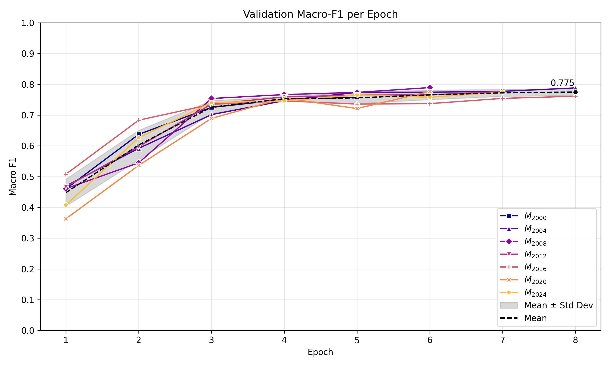
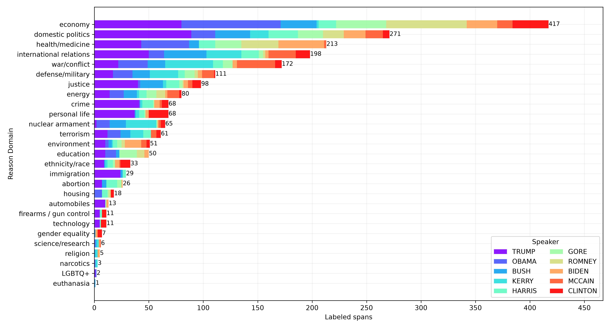
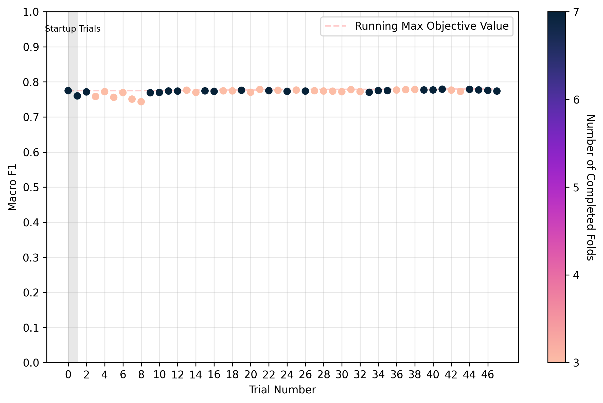
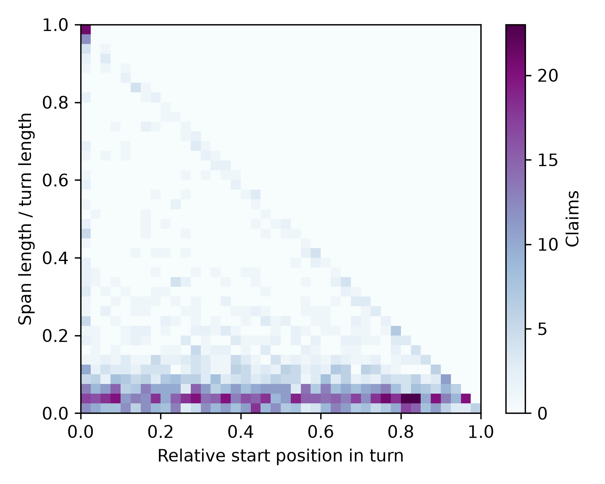

Code for my MSc thesis _"Where the Claim Lies: Check-worthy Claim Span Detection in Political Debates for Automated Fact-Checking"_, to be delivered and defended in October 2026.
Its public availability aims to display the work I've developed in deep learning research for my thesis.

(Work in progress)

Includes:

- raw transcripts
- dataset annotation (LabelStudio), preprocessing, and analysis
- training and tuning scripts of BERT-based transformer language models via PyTorch
- _much more..._

Instructions to run the code and requirements will be assorted before delivery.

Some interesting proof-of-concept images:

